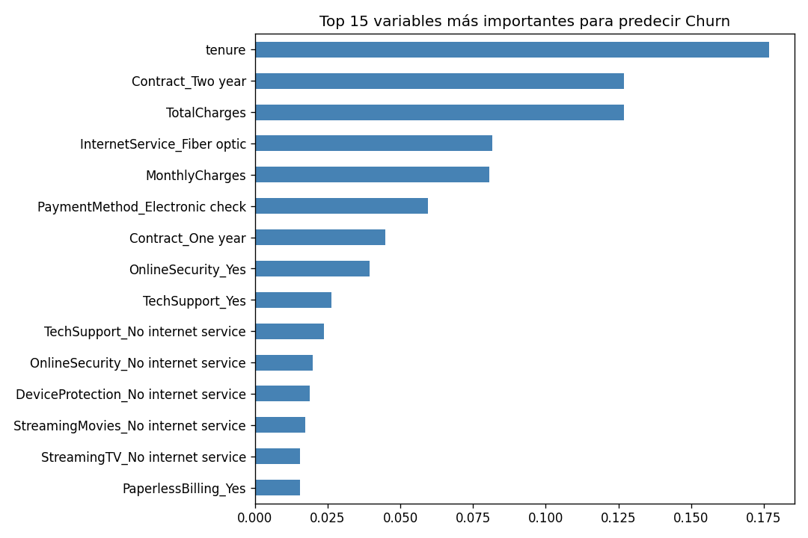
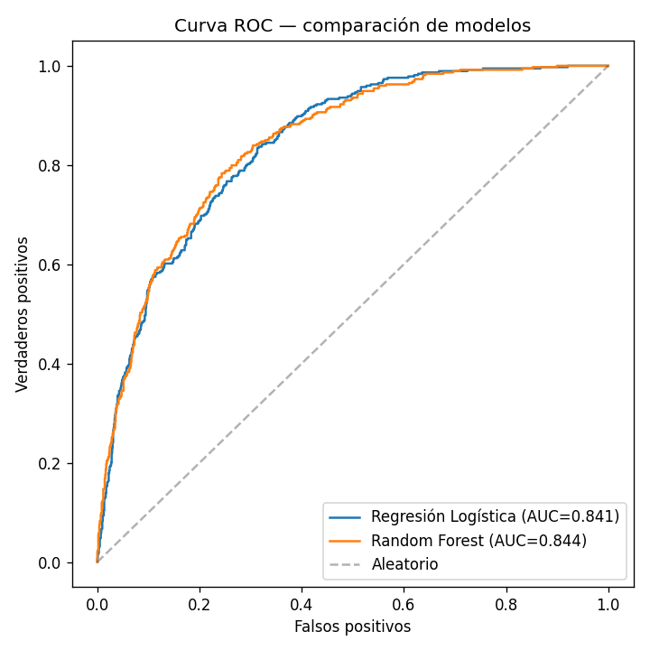

#  Customer Churn Prediction

Predicting customer churn on a real telecom dataset (7,043 customers) — comparing
Logistic Regression vs. Random Forest, with proper evaluation for imbalanced classes.

## Why this project

My [energy demand forecasting project](https://github.com/Moidah/energy-demand-forecasting)
covers regression on time series. This one covers the other classic half of Machine
Learning: **classification**. Churn is also one of the most common business problems
across industries (telecom, banking, SaaS, insurance), so it's a problem any technical
reviewer immediately recognizes and knows how to evaluate.

## What it covers

- End-to-end pipeline: data cleaning → EDA → feature encoding → modeling → evaluation
- Exploratory Data Analysis (class balance, churn by contract type, tenure, monthly charges)
- Two models compared head-to-head:
  - **Logistic Regression** — interpretable baseline, `class_weight="balanced"`
  - **Random Forest** — captures non-linear relationships, gives feature importance
- Evaluation with **AUC-ROC** and **Average Precision** — not accuracy alone, since
  the dataset is imbalanced (73.5% stay / 26.5% churn)

## Results

| Model | AUC-ROC | Average Precision |
|---|---|---|
| Logistic Regression | 0.841 | 0.631 |
| Random Forest | 0.844 | 0.653 |

Random Forest wins, but only slightly — with this dataset, the relationship between
features and churn is fairly linear, so Logistic Regression (much simpler and more
interpretable) already captures most of the signal. That's a useful finding on its
own: the more complex model isn't always the one worth deploying.



*Top predictive features (Random Forest) — customer tenure, contract type, and total
charges are the strongest churn signals.*



## Key EDA findings

- Customers on **month-to-month contracts** churn at **42.7%**, vs. just **2.8%** for
  customers on 2-year contracts.
- Customers with **fiber optic** internet churn at **41.9%**, nearly double the rate
  of DSL customers (**19.0%**) — likely a pricing or competition effect.

## Project structure

```
churn_project/
├── data/
│   └── telco_churn.csv          # Real IBM Telco Customer Churn dataset (7,043 rows)
├── notebooks/
│   ├── 01_eda.py                 # Data cleaning + exploratory analysis
│   └── 02_modeling.py            # Logistic Regression + Random Forest + evaluation
├── outputs/                      # Generated charts and results
└── requirements.txt
```

## How to run it

```bash
pip install -r requirements.txt

cd notebooks
python 01_eda.py
python 02_modeling.py
```

## Data source

[Telco Customer Churn](https://github.com/IBM/telco-customer-churn-on-icp4d) dataset
(IBM) — one of the most widely used real-world datasets for practicing classification.

## Why not just accuracy?

With 73.5% of customers staying, a model that always predicts "stays" would already
score 73.5% accuracy while being completely useless. AUC-ROC and Average Precision
measure how well the model actually separates the two classes, regardless of the
class imbalance — a much more honest metric for this kind of problem.

## Next steps

- Try SHAP values for individual prediction explanations
- Test XGBoost/LightGBM as a third model
- Apply SMOTE to compare performance under class balancing
- Tune the decision threshold based on a business cost function (cost of a missed
  churn vs. cost of an unnecessary retention offer)

## Tech stack

Python · pandas · NumPy · scikit-learn · matplotlib
